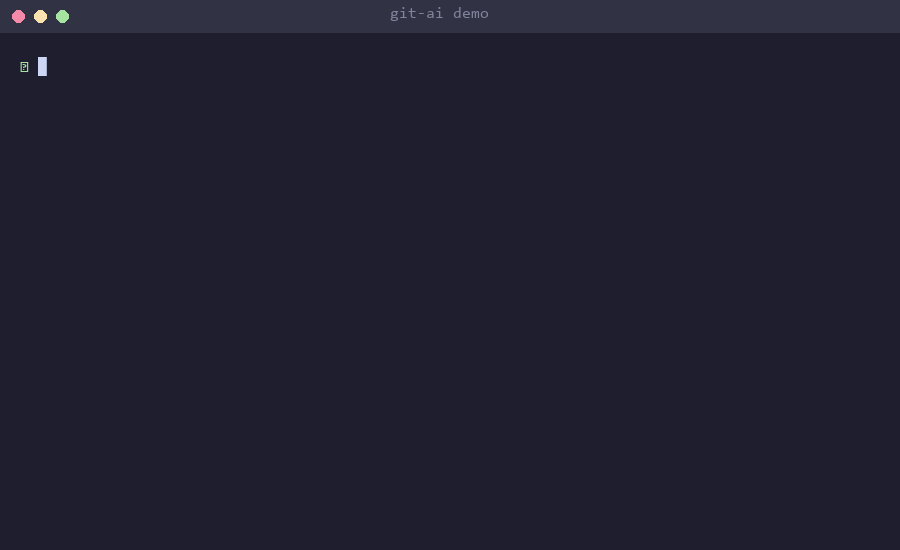

<p align="center">
  
  
  
  
  
</p>

<h1 align="center">git-ai</h1>
<p align="center"><strong>AI that lives inside your Git workflow.<br/>Auto-commits, PRs, changelogs, code review — zero friction.</strong></p>

<p align="center">
  
</p>

---

> **What makes this different?** Unlike other AI commit tools, `git-ai` reads your last 20 commits and **learns your team's style** — format, casing, scope usage, preferred types. It doesn't impose a convention. It mirrors what you already do.

---

## Install

```bash
npm install -g @malikasadjaved/git-ai
```

Or try it instantly:

```bash
npx @malikasadjaved/git-ai@latest setup
```

## 30-Second Quick Start

```bash
git-ai setup              # Pick provider, enter API key, done
git add .                  # Stage your changes
git-ai                     # Generate commit message, confirm, committed
```

That's it. Three commands and you never write a commit message again.

---

## Why git-ai?

| | git-ai | opencommit | aicommits | aicommit2 |
|---|:---:|:---:|:---:|:---:|
| AI commit messages | Yes | Yes | Yes | Yes |
| PR body generation | Yes | - | - | - |
| AI code review | Yes | - | - | - |
| Changelog generation | Yes | - | - | - |
| **Learns your repo style** | **Yes** | - | - | - |
| Ticket auto-linking (JIRA, Linear, GitHub) | Yes | - | - | - |
| Native git hooks (`git commit` just works) | Yes | Partial | Partial | - |
| Ollama / 100% local | Yes | - | - | Partial |
| Multi-alternative selection | Yes | - | - | - |
| Interactive TUI | Yes | Basic | Basic | Basic |
| Providers | 4 | 2 | 2 | 3 |

---

## All Commands

### `git-ai commit` — Generate commit messages

```bash
git-ai commit              # Generate + interactive confirm/edit/regenerate
git-ai commit -y           # Auto-commit, no confirmation
git-ai commit -a           # Stage all files first (git add -A)
git-ai commit -n 3         # Generate 3 alternatives, pick your favorite
git-ai commit -p           # Push after committing
git-ai                     # Shorthand — defaults to commit
```

**What happens:**
1. Reads your staged diff
2. Analyzes your last 20 commits to learn your style
3. Detects ticket IDs from your branch name (`feature/PROJ-123-...`)
4. Generates a message that matches your conventions
5. Shows an interactive prompt: **Commit / Edit / Regenerate / Cancel**

```
  git-ai commit

  3 files changed, 47 insertions(+), 12 deletions(-)

  ──────────────────────────────────────────────────
    Generated commit message:

    feat(auth): add JWT refresh token rotation

    - Implement sliding window refresh token strategy
    - Add token blacklist check on refresh
    - Closes PROJ-142
  ──────────────────────────────────────────────────
  ? What would you like to do?
  > Commit with this message
    Edit message
    Regenerate
    Cancel
```

---

### `git-ai pr` — Generate pull request descriptions

```bash
git-ai pr                  # Generate PR title + body
git-ai pr --gh             # Create PR directly via GitHub CLI
git-ai pr -b develop       # Compare against a specific base branch
```

Generates a structured PR with Summary, Changes, Testing checklist, and auto-linked tickets. Works with `gh` CLI for one-command PR creation.

---

### `git-ai review` — AI code review

```bash
git-ai review              # Review staged changes
git-ai review --full       # Review entire branch diff vs main
git-ai review -b develop   # Review against specific branch
```

Returns findings color-coded by severity:

```
  Code Review

  CRITICAL  SQL injection risk in user input at src/api/users.ts:42
  WARNING   Missing error handling in async function fetchData()
  SUGGESTION  Consider memoizing this expensive computation
```

---

### `git-ai changelog` — Generate changelogs

```bash
git-ai changelog                  # Latest tag to HEAD
git-ai changelog --from v1.0.0   # From specific tag
git-ai changelog --append        # Prepend to existing CHANGELOG.md
git-ai changelog --output CHANGES.md
```

Produces [keepachangelog.com](https://keepachangelog.com) format, grouped by: Breaking Changes, Added, Fixed, Changed, Performance, Documentation.

---

### `git-ai hook` — Zero-friction git hooks

```bash
git-ai hook install            # Install for current repo
git-ai hook install --global   # Install for all repos
git-ai hook uninstall
git-ai hook status
```

Once installed, just use `git commit` as normal — git-ai generates the message automatically via the `prepare-commit-msg` hook. No new command to remember.

---

### `git-ai setup` — Interactive wizard

```bash
git-ai setup
```

```
  Welcome to git-ai! Let's get you set up.

  Step 1/4: Choose your AI provider
  > Claude (Anthropic) — Best quality
    GPT-4o-mini (OpenAI) — Fast and cheap
    Gemini Flash (Google) — Free tier available
    Ollama (Local) — 100% free, runs offline

  Step 2/4: Enter your API key
  > ************************************

  Step 3/4: Choose commit style
  > Auto-detect from your repo history

  Step 4/4: Install git hooks?
  > Yes, install for this repo only

  Setup complete!
  Try it with: git add . && git-ai commit
```

---

## Providers

### Claude (Anthropic) — Recommended
```bash
export ANTHROPIC_API_KEY=sk-ant-...
```
Models: `claude-haiku-4-5` (fast, default) · `claude-sonnet-4-5` (higher quality)

### OpenAI
```bash
export OPENAI_API_KEY=sk-...
```
Models: `gpt-4o-mini` (fast, default) · `gpt-4o`

### Google Gemini
```bash
export GEMINI_API_KEY=...
```
Models: `gemini-1.5-flash` (fast, default) · `gemini-1.5-pro`

### Ollama (Local / Free / Offline)
```bash
ollama pull llama3.2
git-ai setup   # select Ollama
```
No API key. No cost. No internet. Runs entirely on your machine.

---

## Style Learning

git-ai doesn't just generate commit messages — it generates **your** commit messages.

On every run, it analyzes your last 20 commits and detects:

| Signal | Example |
|--------|---------|
| **Format** | Conventional Commits (`feat: ...`), Gitmoji, or plain English |
| **Scope** | `feat(auth): ...` vs `feat: ...` |
| **Casing** | `fix: resolve bug` vs `Fix: Resolve bug` |
| **Length** | Matches your average first-line length |
| **Types** | Your most-used prefixes (`feat` > `fix` > `chore`) |

The AI prompt includes 3 real examples from your history, so generated messages are indistinguishable from human-written ones.

---

## Branch Intelligence

git-ai reads your branch name and adapts:

| Branch | Behavior |
|--------|----------|
| `feature/PROJ-123-add-auth` | Extracts `PROJ-123`, includes in commit footer |
| `fix/GH-42-memory-leak` | Links to GitHub issue `#42` |
| `hotfix/critical-fix` | Detected as hotfix, adjusts message tone |
| `release/2.0` | Detected as release branch |

Supports: JIRA, Linear, GitHub Issues, and any `PREFIX-NUMBER` pattern.

---

## Configuration

Stored at `~/.config/git-ai/config.json`. Set via `git-ai setup` or edit directly.

| Key | Default | Description |
|-----|---------|-------------|
| `provider` | `anthropic` | `anthropic` · `openai` · `gemini` · `ollama` |
| `model` | `claude-haiku-4-5` | Model to use for generation |
| `commit_style` | `auto` | `auto` · `conventional` · `gitmoji` · `plain` |
| `locale` | `en` | Language for generated messages |
| `max_diff_tokens` | `3000` | Max tokens sent to the AI |
| `auto_stage` | `false` | Run `git add -A` before generating |
| `push_after_commit` | `false` | Auto-push after commit |
| `custom_instructions` | — | Extra rules appended to every prompt |
| `ollama_url` | `http://localhost:11434` | Ollama server URL |

---

## Smart Diff Handling

Large diffs are handled gracefully:
- Lock files (`package-lock.json`, `yarn.lock`, `pnpm-lock.yaml`) are automatically excluded
- Binary files and minified assets are skipped
- Source code files (`.ts`, `.py`, `.js`, `.go`, `.rs`) are prioritized
- Remaining diff is intelligently truncated with `[... N lines truncated ...]` markers
- You'll never hit a token limit error

---

## Contributing

```bash
git clone https://github.com/Malikasadjaved/git-ai.git
cd git-ai
npm install
npm run build
npm test
```

PRs welcome. Please follow the existing code style.

---

## License

[MIT](LICENSE)

---

<p align="center">
  <sub>Built with frustration from writing commit messages manually.</sub>
</p>
